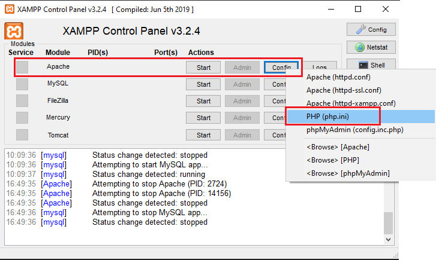

# PASOS PARA CORRER EL BACK EN FORMA LOCAL

1 - Instalar XAMPP 7.1

[XAMPP V7.1](https://sourceforge.net/projects/xampp/files/XAMPP%20Windows/7.1.33/)

Descargar: xampp-windows-x64-7.1.33-1-VC14-installer.exe

2 - Instalar el XAMPP. Cambiar el nombre de la carpeta donde instala el XAMPP en la instalación. Por ejemplo:


```
C:\{...NombreCarpetaXAMPP...}
```

3 - Abrir el XAMPP. En el servicio de Apache, hacer click en Config y luego en php.ini. En el notepad que abre buscar max_execution_time y modificar la línea por: 



```
max_execution_time = 300
```

4 - Clonar el repo 

[Repo Back](https://github.com/customer-scoops/api-cux-bakend)

En la capeta donde se instalo el XAMPP

```
C:\{...NombreCarpetaXAMPP...}\xampp\htdocs
```

5 - Iniciar MySQL en XAMPP

### 6 - Solicitar la DB de prueba!!!!

7 - Iniciar una consola

8 - Entrar en

```
C:\{...NombreCarpetaXAMPP...}\mysql\bin
```

9 - Ejecutar 

```
mysql.exe -u root -p
```

10 - Luego ejecutar 

```
MariaDB [(none)]> create database {...NombreDB...};
```

11 - Luego
 
```
MariaDB [(none)]> use {...NombreDB...};
```

12 - Después

```
MariaDB [(none)]>  source {DireccionDescargaDB}\{NombreArchivo}.sql;
```

13 - Descargar e instalar Composer 

[Composer](https://getcomposer.org/download/)

14 - En la instalacion buscar el php.exe que esta en la carpeta del XAMPP 

```
C:\{...NombreCarpetaXAMPP...}\php\php.exe
```


15 - Entrar con la consola a 

```
C:\{...NombreCarpetaXAMPP...}\htdocs\api-cux-bakend
```

16 - Hacer 

```
composer install
```

17 - Abrir el proyecto

18 - Entrar en el archivo 

```
vendor\auth0\auth0-php\src\Helpers\Tokens\TokenVerifier.php
```

19 - Comenta las lineas 112 a 130, que son las que siguen a:


	 
20 - Crear un archivo

```
.env
```

21 - Copiar el contenido de 

```
.env.example
```

22 - Modificar y agregar las siguientes líneas
```
DB_CONNECTION={mysql}
DB_HOST={127.0.0.1}
DB_PORT={3306}
DB_DATABASE={homestead}
DB_USERNAME={homestead}
DB_PASSWORD=
DB_STRICT_MODE=false

```

### Solicitar las líneas de AUTH0!!!!

23 - Iniciar los servicios de apache y mysql en el XAMPP


24 - Abrir el Postman

25 - Hacer una nueva poticion HTTP en la pestaña 


26 - Hacer la petición al endpoint 

```
http://localhost:80/api-cux-bakend/public/api/surveys
```
En caso de obtener una respuesta quedó el back andando

